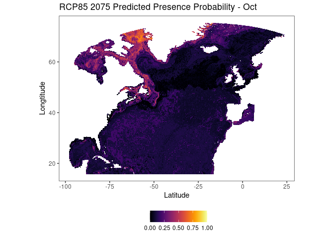
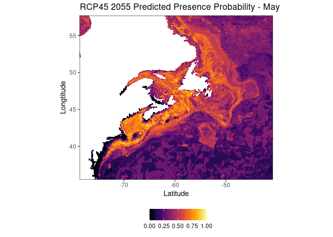
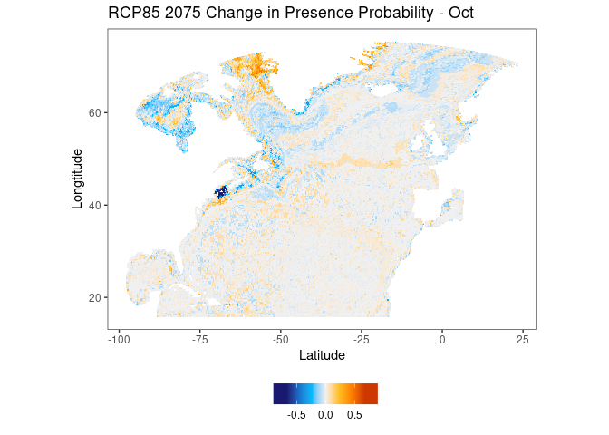
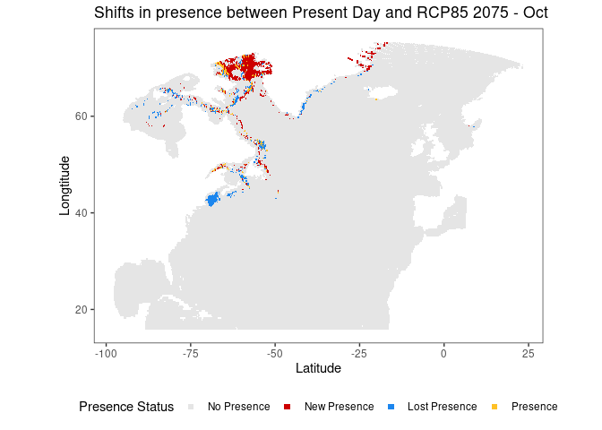

Environmental Modeling Walkthrough using Brickman's Downscaled IPCC Covariates
================

**Table of Contents**

-   [Overview](#overview)
-   [Data preparation](#data-preparation)
-   [Modeling](#modeling)
-   [Model Evaluation](#model-evaluation)
-   [Predictions and Plots](#predictions-and-plots)

This repository contains resources and a walkthrough for modeling
presence/absence data in North Atlantic using covariates from [Brickman
et.
al. 2021](https://online.ucpress.edu/elementa/article/9/1/00055/116900/Projections-of-physical-conditions-in-the-Gulf-of).
Files included in this repository are:

-   **README.md** (this document): Overview and walkthrough of Brickman
    modeling process
-   [**brickman_walkthrough.R**](https://github.com/oj713/brickman-walkthrough/blob/main/brickman_walkthrough.R):
    the complete R code used in the modeling walkthrough
-   [**brickman_walkthrough_help.R**](https://github.com/oj713/brickman-walkthrough/blob/main/brickman_walkthrough_help.R):
    code for three helper functions that can generate predictions and
    plots

## Overview

The Brickman dataset consists of environmental covariates for a variety
of climate scenarios in the North Atlantic. Covariates were generated by
downscaling low-resolution IPCC data to a much higher 1/12 degree
resolution. The Brickman dataset contains high resolution datasets for
present day (2015), 2055, and 2075 for RCP 45 and 85 conservation
scenarios. Environmental covariates available include bathymetry, bottom
stress, mixed layer depth, sea surface / sea bottom temperature and
salinity, and current vectors.

**Brickman coordinate bounding box:**

xmin = -101.5, xmax = -24.5, ymin = 16.0, ymax = 75.2

This walkthrough provides a guide for building a presence/absence model
using the Brickman dataset. By training a model with present-day
covariates, we can generate high resolution projections for the four
available future climate situations. Example projections are in the
[Predictions and Plots](#predictions-and-plots) section. This code is
beginner-friendly and can perform the entire modeling process for a
provided dataset, but to improve and modify the model or predictions
more coding experience may be required.

-   This code is for building a model that takes month as a covariate.
    Predicted output is on a monthly basis. Building an annual model is
    possible, but requires some changes to Brickman variable extraction.
-   All code must be run within Bigelow’s ecocast server to function. To
    run outside of ecocast, the Brickman datasets must be downloaded and
    have their paths specified within `brickman` package methods.
-   This walkthrough makes use of the base R pipe operator,
    [`|>`](https://www.infoworld.com/article/3621369/use-the-new-r-pipe-built-into-r-41.html).
-   Questions? Comments? Contact me by email at <ojohnson@bigelow.org>

**Required Packages**

``` r
# for modeling and loading packages such as dplyr, purrr, and ggplot2
library(tidymodels) 
# for handling Brickman data 
library(stars) 
library(brickman) 
# for plotting 
library(viridis)
```

\* *The `brickman` package was written by Ben Tupper and is available on
ecocast and [GitHub](https://github.com/BigelowLab/brickman).*

## Data Preparation

``` r
set.seed(607)
```

To begin, choose your desired presence/absense data and assign it to
`pa_data`. The data should be an `sf` object (crs 4326) and have the
following columns:

-   `PRESENCE`: factor, either 0 or 1
-   `MONTH`: numeric, 1 through 12

Make sure that all datapoints in `pa_data` are within the Brickman
coordinate bounding box (see [Overview](#overview)). To convert a
dataframe to `sf`, use
[`st_as_sf()`](https://www.rdocumentation.org/packages/sf/versions/1.0-7/topics/st_as_sf).

For the walkthrough, we will be using *C. Finmarchicus* data collected
from the [Ecomon
survey](https://www.st.nmfs.noaa.gov/copepod/data/us-05101/index.html).
We will consider *C. Finmarchicus* present if there are more than 10,000
individuals per square meter.

``` r
library(ecomon) # not needed if not working with ecomon data

# substitute your own dataset in here
pa_data <- ecomon::read_staged(species = "calfin", form = "sf") |>
  transmute(PRESENCE = (total_m2 > 10000) |> as.numeric() |> as.factor(),
            MONTH = lubridate::month(date))

pa_data
```

    ## Simple feature collection with 24387 features and 2 fields
    ## Geometry type: POINT
    ## Dimension:     XY
    ## Bounding box:  xmin: -75.9283 ymin: 35.2033 xmax: -65.2483 ymax: 44.77
    ## Geodetic CRS:  WGS 84
    ## # A tibble: 24,387 × 3
    ##    PRESENCE MONTH           geometry
    ##  * <fct>    <dbl>        <POINT [°]>
    ##  1 0            2 (-70.6667 41.1833)
    ##  2 0            2 (-70.6667 41.0167)
    ##  3 0            2         (-71.5 41)
    ##  4 0            2 (-71.0167 40.5167)
    ##  5 0            2    (-71.5 40.2667)
    ##  6 0            2     (-71.75 40.15)
    ##  7 0            2 (-69.9667 40.2333)
    ##  8 0            2      (-70 40.0167)
    ##  9 0            2        (-69 40.25)
    ## 10 0            2         (-69 40.5)
    ## # … with 24,377 more rows

Next, define `VARS`, the list of Brickman environmental covariates to
include in the modelling process. A complete list of available
covariates is below: subset this as you desire.

-   `Bathy_depth`: bathymetry
-   `Xbtm`: bottom stress
-   `MLD`: mixed layer depth
-   `Sbtm`, `Tbtm`: sea bottom salinity, temperature
-   `SSS`, `SST`: sea surface salinity, temperature
-   `U`, `V`: horizontal and vertical current velocity

``` r
# COVARIATES
VARS <- c("Bathy_depth", "Xbtm", "MLD", "Sbtm", "SSS", "SST", "Tbtm", "U", "V")
```

Finally, use the `brickman::extract_points()` method to match `pa_data`
to present-day Brickman covariates and create the input dataset for the
model.

-   `pa_data` is matched to Brickman covariates by pairing each
    presence/absence location with the geographically closest Brickman
    datapoint.

``` r
# pairing brickman present data to presence data
model_data <- brickman::extract_points(brickman::compose_filename("PRESENT"), 
                                       vars = VARS, 
                                       pts = pa_data, 
                                       complete = TRUE,
                                       simplify_names = TRUE) |>
  # binding the original dataset and selecting needed columns
  bind_cols(pa_data) |>
  select(lat, lon, PRESENCE, MONTH, all_of(VARS)) |>
  rowwise() |>
  # monthly variables are returned as a list with 12 values - must extract correct month
  mutate_at(VARS[!VARS == "Bathy_depth"], ~.x[[MONTH]]) |>
  ungroup() |>
  # converting month to a factor
  # remove this line to treat month as continuous ~ requires changes to get_predictions()
  mutate(MONTH = as.factor(MONTH)) 

# input dataset for workflow
model_data
```

    ## # A tibble: 24,387 × 13
    ##      lat   lon PRESENCE MONTH Bathy_depth     Xbtm   MLD  Sbtm   SSS   SST  Tbtm
    ##    <dbl> <dbl> <fct>    <fct>       <dbl>    <dbl> <dbl> <dbl> <dbl> <dbl> <dbl>
    ##  1  41.2 -70.6 0        2            36.6 0.00244   22.7  31.0  30.9  2.87  3.12
    ##  2  41.0 -70.6 0        2            45.1 0.00249   35.8  31.1  31.0  3.20  3.33
    ##  3  41.0 -71.5 0        2            43.9 0.00460   26.8  31.4  31.2  3.94  4.46
    ##  4  40.5 -71.0 0        2            76.6 0.00380   41.2  32.5  31.3  4.23  6.95
    ##  5  40.3 -71.5 0        2            85.1 0.00733   35.3  33.4  31.4  4.54  8.73
    ##  6  40.1 -71.8 0        2            83.4 0.00531   33.9  33.6  31.4  4.69  9.09
    ##  7  40.2 -69.9 0        2            93.0 0.00169   30.0  33.8  31.3  4.22  8.74
    ##  8  40.0 -70.0 0        2           234.  0.000930  23.2  35.0  31.5  4.79  8.35
    ##  9  40.3 -69.0 0        2           113.  0.00162   22.9  34.5  31.4  4.47  9.36
    ## 10  40.5 -69.0 0        2            74.7 0.00515   30.2  32.9  31.2  4.05  6.95
    ## # … with 24,377 more rows, and 2 more variables: U <dbl>, V <dbl>

## Modeling

Next, use `Tidymodels` to build a `workflow` object modeling
`model_data`. An example workflow is below, but feel free to change
recipes, models, or splitting techniques as desired.

-   The example recipe converts `U` and `V` to a single `Vel` attribute
    representing overall current velocity.
-   For more information on modeling with `Tidymodels`, check out my
    [`Tidymodels Tutorial`](https://oj713.github.io/tidymodels/).

``` r
# performing the initial testing/training split
# training data will be used to train the model, and the testing data is used
#   to assess model performance
data_split <- initial_split(model_data, prop = 3/4, strata = PRESENCE)
training_data <- training(data_split)
testing_data <- testing(data_split)

# the recipe contains the formula for the model and data preprocessing steps
# note that the recipe passed in is modified by update_role() and step_mutate()
recipe <- recipe(PRESENCE ~ ., data = training_data) |>
  update_role(lat, lon, U, V, new_role = "ID") |>
  step_mutate(Vel = sqrt(U^2 + V^2), role = "predictor") |>
  step_corr(all_numeric_predictors(), threshold = .95) |>
  step_zv(all_predictors()) |>
  step_normalize(all_numeric_predictors())

# example model specification: random forest
model <- rand_forest(trees = 15) |>
  set_engine("ranger") |>
  set_mode("classification")

# workflow: bundling preprocessing and model together
workflow <- workflow() |>
  add_recipe(recipe) |>
  add_model(model) |>
  fit(training_data)

workflow
```

    ## ══ Workflow [trained] ══════════════════════════════════════════════════════════
    ## Preprocessor: Recipe
    ## Model: rand_forest()
    ## 
    ## ── Preprocessor ────────────────────────────────────────────────────────────────
    ## 4 Recipe Steps
    ## 
    ## • step_mutate()
    ## • step_corr()
    ## • step_zv()
    ## • step_normalize()
    ## 
    ## ── Model ───────────────────────────────────────────────────────────────────────
    ## Ranger result
    ## 
    ## Call:
    ##  ranger::ranger(x = maybe_data_frame(x), y = y, num.trees = ~15,      num.threads = 1, verbose = FALSE, seed = sample.int(10^5,          1), probability = TRUE) 
    ## 
    ## Type:                             Probability estimation 
    ## Number of trees:                  15 
    ## Sample size:                      18289 
    ## Number of independent variables:  8 
    ## Mtry:                             2 
    ## Target node size:                 10 
    ## Variable importance mode:         none 
    ## Splitrule:                        gini 
    ## OOB prediction error (Brier s.):  0.1320433

## Model Evaluation

Evaluate the model with whatever tools you desire. Some examples of
analyses are below.

``` r
# using augment to make predictions for the test dataset 
test_results <- augment(workflow, testing_data)

# note .pred_class, .pred_0 and .pred_1 columns
dplyr::glimpse(test_results)
```

    ## Rows: 6,098
    ## Columns: 16
    ## $ lat         <dbl> 40.78967, 42.32255, 41.01825, 41.48721, 42.26971, 42.33488…
    ## $ lon         <dbl> -69.03500, -69.94368, -66.96130, -66.98309, -66.02243, -65…
    ## $ PRESENCE    <fct> 0, 0, 0, 0, 0, 0, 0, 0, 0, 0, 0, 0, 0, 1, 0, 0, 0, 1, 1, 1…
    ## $ MONTH       <fct> 2, 2, 2, 2, 2, 2, 2, 3, 3, 3, 3, 3, 3, 3, 3, 3, 3, 3, 3, 3…
    ## $ Bathy_depth <dbl> 70.81680, 173.86778, 74.30029, 59.65366, 236.74553, 162.35…
    ## $ Xbtm        <dbl> 0.029910511, 0.001796889, 0.002320968, 0.011585404, 0.0158…
    ## $ MLD         <dbl> 35.944938, 41.321999, 23.291612, 31.152545, 22.944687, 19.…
    ## $ Sbtm        <dbl> 32.34280, 34.18937, 33.38723, 32.41780, 34.84989, 34.64002…
    ## $ SSS         <dbl> 31.23745, 31.21508, 31.12386, 30.95915, 30.75386, 30.79176…
    ## $ SST         <dbl> 3.492243, 2.290613, 3.554846, 3.158253, 2.355116, 2.238144…
    ## $ Tbtm        <dbl> 5.317258, 7.193180, 7.277824, 5.908505, 7.275045, 8.194640…
    ## $ U           <dbl> -5.707603e-05, 1.230224e-03, -9.438548e-04, -8.058323e-03,…
    ## $ V           <dbl> -0.069329586, -0.004909825, -0.006463766, -0.030135087, 0.…
    ## $ .pred_class <fct> 0, 0, 0, 0, 0, 0, 0, 0, 0, 1, 0, 0, 0, 1, 0, 0, 0, 1, 0, 0…
    ## $ .pred_0     <dbl> 0.99259259, 0.70500000, 0.99259259, 1.00000000, 0.85333333…
    ## $ .pred_1     <dbl> 0.007407407, 0.295000000, 0.007407407, 0.000000000, 0.1466…

-   [`Yardstick`](https://yardstick.tidymodels.org/) provides methods to
    easily collect performance metrics.

``` r
# defining and retrieving desired metrics
pa_metrics <- yardstick::metric_set(roc_auc, sens, spec, accuracy)
pa_metrics(test_results, 
           truth = PRESENCE, 
           estimate = .pred_class, 
           .pred_1,
           event_level = "second")
```

    ## # A tibble: 4 × 3
    ##   .metric  .estimator .estimate
    ##   <chr>    <chr>          <dbl>
    ## 1 sens     binary         0.721
    ## 2 spec     binary         0.873
    ## 3 accuracy binary         0.823
    ## 4 roc_auc  binary         0.887

-   By splitting the results table by month, we can collect a monthly
    performance breakdown.

``` r
# building a table that contains AUC for each month of predictions
auc_monthly <- count(test_results, MONTH) |>
  bind_cols(AUC = split(test_results, test_results$MONTH) |> 
              lapply(function(x) roc_auc_vec(x$PRESENCE,
                                             x$.pred_1,
                                             event_level = "second")) |>
      unlist()) |>
  mutate(MONTH = as.numeric(MONTH))

# plotting the AUC by month 
ggplot(data = auc_monthly, 
       mapping = aes(x = MONTH, y = AUC)) +
  geom_line() +
  geom_point() +
  scale_x_continuous(name = "Month", 
                     breaks = 1:12, 
                     labels = c("Jan", "Feb", "Mar", "Apr", 
                                "May", "Jun", "Jul", "Aug",
                                "Sep", "Oct", "Nov", "Dec")) +
  scale_y_continuous(name = "AUC", limits = c(.5, 1)) +
  ggtitle("AUC by Month") +
  theme_classic() + 
  theme(panel.grid.major.y = element_line())
```

<!-- -->

## Predictions and Plots

Now, using `workflow` we can generate and visualize monthly predictions
for a desired Brickman climate sitation.
[`brickman_walkthrough_help.R`](https://github.com/oj713/brickman-walkthrough/blob/main/brickman_walkthrough_help.R)
defines three helper functions to assist with this portion of the
modeling process:

-   **`get_predictions()`** takes a workflow and returns a list of
    by-month predictions for a desired climate situation.
-   **`get_value_plots()`** creates plots presence probabilities from a
    prediction list.
-   **`get_threshold_plots()`** creates plots showing how presence
    shifts between climate situations relative to a desired threshold.

First, generate predictions using `get_predictions()`.

-   Although we trained the model on present-day data, note that I’m
    still generating present predictions. The training data likely will
    not cover the entire extent of the Brickman dataset. By generating
    present predictions, we can see projections for areas outside of the
    training data’s bounds as well as create a point of reference for
    how predictions change between present and future climate
    situations.  
-   The `downsample` argument represents the desired resolution of
    predictions. 0 represents original resolution (1 datapoint per 1/12
    square degrees), and higher values represent lower resolutions. For
    more information on how `downsample` scales the Brickman data, see
    [`stars::st_downsample()`](https://r-spatial.github.io/stars/reference/st_downsample.html).
    **Due to ecocast’s RAM limitations, this walkthrough can only
    support `downsample` values of 1 or higher.**
    - Original resolution (`downsample = 0`) predictions and plots have large file sizes that
    will overwhelm ecocast’s RAM. To project at original resolution, I’d
    suggest reworking the `brickman_walkthrough_help.R` methods so that
    each month of predictions is saved separately to file and plotting
    methods read in prediction data one month at a time.

``` r
source("brickman_walkthrough_help.R")

# predictions for the most extreme climate situation: RCP85 2075. 
rcp85_2075 <- get_predictions(wkf = workflow, # a fitted workflow used to predict
                              brickman_vars = VARS, # needed brickman covariates
                              year = 2075, # year of predictions
                              scenario = "RCP85", # scenario of predictions
                              augment_preds = FALSE, # bind predictions to covariates?
                              verbose = FALSE, 
                              downsample = 3) # resolution of predictions

# present day predictions
# Since I intend to compare RCP85 2075 to present day, the downsample value must be the same
present_preds <- get_predictions(wkf = workflow, 
                                 brickman_vars = VARS, 
                                 year = NA, # note that PRESENT is a scenario, not a year
                                 scenario = "PRESENT",
                                 augment_preds = FALSE,
                                 verbose = FALSE,
                                 downsample = 3)

# predictions for the least extreme future climate situation: RCP45 2055
# Generating these predictions at a higher resolution
rcp45_2055 <- get_predictions(wkf = workflow, 
                              brickman_vars = VARS,
                              year = 2055, 
                              scenario = "RCP45", 
                              augment_preds = FALSE, 
                              verbose = FALSE, 
                              downsample = 1) # higher resolution

# list of 12 tibbles of prediction data - 1 per month
length(rcp85_2075)
```

    ## [1] 12

``` r
# can index by month number or by 3 letter abbreviation of desired month
rcp45_2055[["Oct"]]
```

    ## # A tibble: 199,783 × 6
    ##    .pred_0 .pred_1   lon   lat MONTH .pred_class
    ##      <dbl>   <dbl> <dbl> <dbl> <fct> <fct>      
    ##  1   0.825   0.175  6.20  37.0 10    0          
    ##  2   0.825   0.175  6.21  37.1 10    0          
    ##  3   0.825   0.175  6.21  37.2 10    0          
    ##  4   0.825   0.175  6.22  37.3 10    0          
    ##  5   0.825   0.175  6.22  37.5 10    0          
    ##  6   0.825   0.175  6.23  37.6 10    0          
    ##  7   0.825   0.175  6.23  37.7 10    0          
    ##  8   0.825   0.175  6.23  37.8 10    0          
    ##  9   0.809   0.191  6.24  38.0 10    0          
    ## 10   0.825   0.175  6.24  38.1 10    0          
    ## # … with 199,773 more rows

There are three pre-defined ways to visualize prediction data:

-   **Raw**: Plot the predicted presence probability for a climate
    situation. This is best for understanding where a model places
    presences and absences.
-   **Difference**: Plot the difference in presence probability between
    two different climate situations. This is best for understanding how
    raw probabilities may shift over time.
-   **Threshold**: Plot how presence probability shifts relative to a
    desired threshold. This is best for examining how high-presence
    areas shift between climate situations.

Use `get_value_plots()` to retrieve raw or difference plots, and use
`get_threshold_plots()` to retrieve threshold plots. Both of these
methods return a list of 12 `ggplot` objects named by month.

-   If creating a difference or threshold plot, ensure that the
    downsample value is the same for both the original and comparison
    predictions.

``` r
# raw plots for RCP85 2075
raw_plots_rcp85_2075 <- get_value_plots(preds_list = rcp85_2075, # prediction data 
                                        title = "RCP85 2075 Predicted Presence Probability",
                                         # size of points in graph - optimal value depends on crop and downsample
                                        pt_size = .3, 
                                        xlim = NULL, # optional bounds for plot, if zooming in on an area 
                                        ylim = NULL)

# Where are the predicted presence probabilities for RCP85 2075 in October?
raw_plots_rcp85_2075[["Oct"]]
```

<!-- -->

``` r
# another example of raw plots, now for RCP45 2055 
# This plot is cropped to the Gulf of Maine / Gulf of St. Lawrence
raw_plots_rcp45_2055 <- get_value_plots(preds_list = rcp45_2055, 
                                        title = "RCP45 2055 Predicted Presence Probability",
                                        pt_size = .4, # note adjusted point size
                                        xlim = c(-77.0, -42.5), # cropping
                                        ylim = c(36.5,  56.7))

# What are the predicted presence probabilities for RCP45 2055 in May in the GoM/GSL? 
raw_plots_rcp45_2055[["May"]]
```

<!-- -->

``` r
# difference plots for RCP85 2075 relative to present day
difference_plots <- get_value_plots(preds_list = rcp85_2075,
                                    title = "RCP85 2075 Change in Presence Probability",
                                    pt_size = .3,
                                    xlim = NULL, 
                                    ylim = NULL,
                                    # optional comparison argument indicates need for 
                                    comparison_list = present_preds)

# How have probabilities shifted between present day and RCP85 2075?
difference_plots[["Oct"]]
```

<!-- -->

``` r
# threshold plots for RCP85 2075, relative to present day
threshold_plots <- get_threshold_plots(preds_list = rcp85_2075, # target prediction data
                                       comparison_list = present_preds, # comparison prediction data
                                       threshold = .5, # threshold for presence
                                       title = "Shifts in presence between Present Day and RCP85 2075",
                                       pt_size = .3,
                                       xlim = NULL,
                                       ylim = NULL)

# Where are the new, lost, and maintained presence areas in RCP85 2075 relative to present day?
threshold_plots[["Oct"]]
```

<!-- -->

[Jump to Top](#top)
